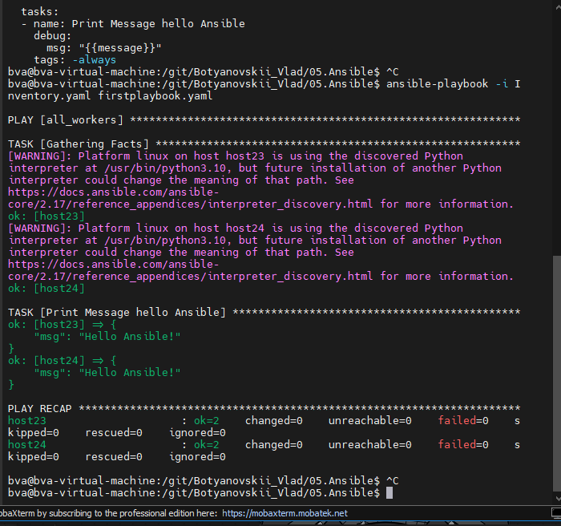
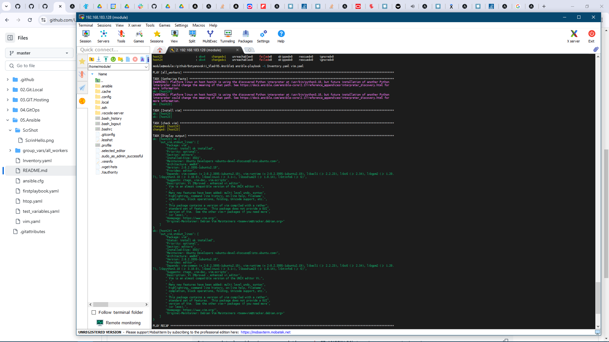
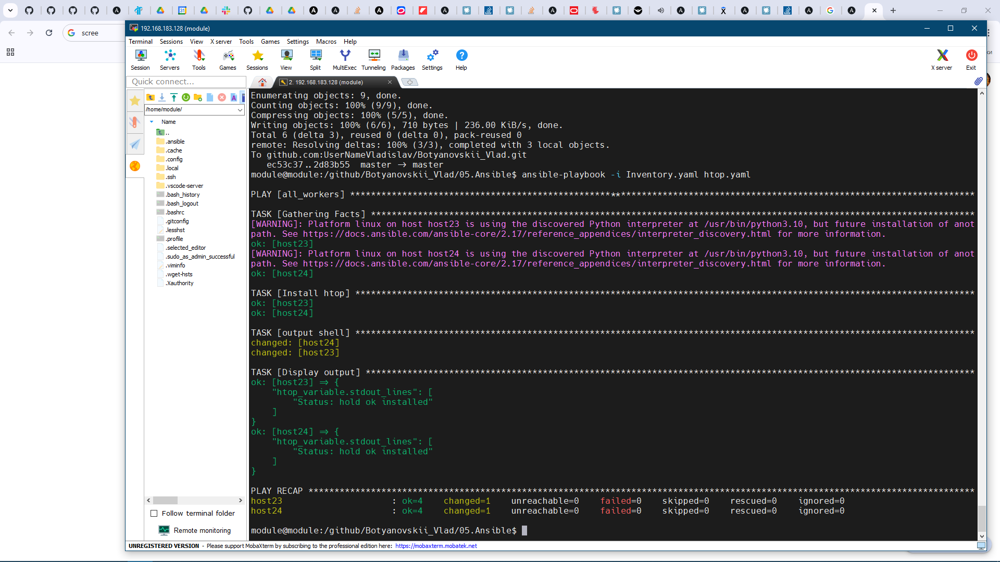

## 05. Ansible start

## Homework Assignment 1: Setting Up Ansible
```bash
Install Ansible on your local machine or a virtual environment.
Create a directory for your Ansible playbooks and configuration files.
  153  cd /git/Botyanovskii_Vlad/
  154  ls
  155  cd 05.Ansible
  156  mkdir 05.Ansible
  157  ls
  158  cd 05.Ansible/
  159  ls
  160  vim Inventory.yaml
  161  sudo apt install python3-pip
  162  sudo pip3 install ansible
  163  sudo apt install python3-pip
  164  sudo apt-get update
  165  sudo apt-get upgrade
  166  sudo apt install python3-pip
  167  sudo pip install ansible

Write an Ansible playbook that prints "Hello, Ansible!" to the console.
- hosts: all_workers
  vars:
    message: "Hello Ansible!"

  tasks:
  - name: Print Message hello Ansible
    debug:
      msg: "{{message}}"
    tags: -always

Run the playbook using the ansible-playbook command and ensure it executes successfully.
```

 
```bash


Document the installation process and the steps you took to run the playbook.
Documented ++
```

##Homework Assignment 2: Managing Remote Hosts
```bash
Set up a virtual machine (or use an existing one in IT-ACADEMY DC) to act as your remote target.
Ensure SSH access to the remote machine from your local machine.


Write an Ansible playbook to install a basic package (e.g., vim or htop) on the remote host.
```



```bash

Use inventory files to manage the connection details for the remote host.
Execute the playbook and verify that the package is installed on the remote host.
```

##Homework Assignment 3: Managing Users and Groups
```bash
Create a playbook to manage users and groups on a remote host.
Define tasks to create a new user, assign the user to a specific group, and set a password.
Parameterize the playbook to allow dynamic user and group names.
Execute the playbook and verify that the user and group configurations are applied.
Your ansible project add to folder 05.Ansible.start, create README.md with short report inside and prepare PR
```
