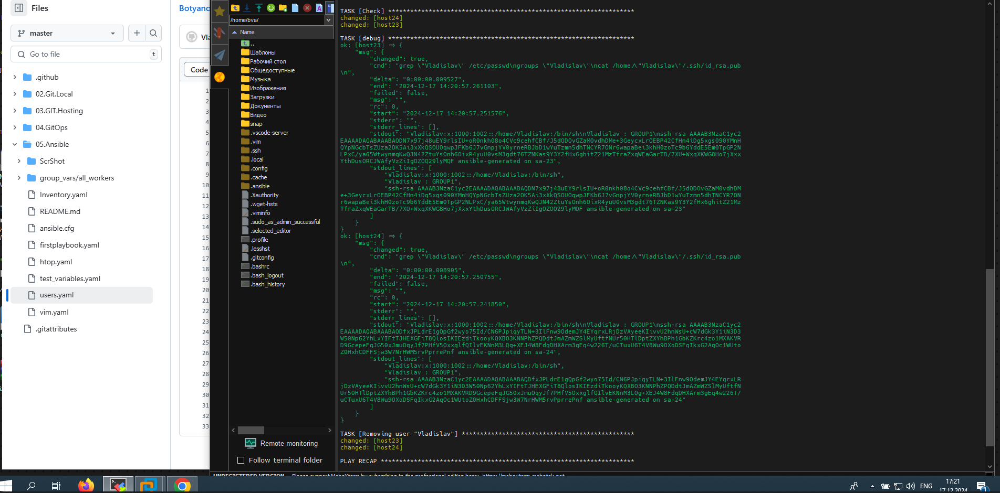

## 05. Ansible start

## Homework Assignment 1: Setting Up Ansible
```bash
Install Ansible on your local machine or a virtual environment.
Create a directory for your Ansible playbooks and configuration files.
  153  cd /git/Botyanovskii_Vlad/
  154  ls
  155  cd 05.Ansible
  156  mkdir 05.Ansible
  157  ls
  158  cd 05.Ansible/
  159  ls
  160  vim Inventory.yaml
  161  sudo apt install python3-pip
  162  sudo pip3 install ansible
  163  sudo apt install python3-pip
  164  sudo apt-get update
  165  sudo apt-get upgrade
  166  sudo apt install python3-pip
  167  sudo pip install ansible

Write an Ansible playbook that prints "Hello, Ansible!" to the console.
- hosts: all_workers
  vars:
    message: "Hello Ansible!"

  tasks:
  - name: Print Message hello Ansible
    debug:
      msg: "{{message}}"
    tags: -always

Run the playbook using the ansible-playbook command and ensure it executes successfully.
```

 ```bash

Document the installation process and the steps you took to run the playbook.

Documented ++


##Homework Assignment 2: Managing Remote Hosts

Set up a virtual machine (or use an existing one in IT-ACADEMY DC) to act as your remote target.
Ensure SSH access to the remote machine from your local machine.

## Закидываем наш ssh key в бастион хост 
ssh-copy-id -p 32510 jump_sa@178.124.206.53 -yes
добавляем ключ
## Он указывается в авторизейшен кей и пропускает нас 
## Было несколько ключей и нестандартное имя (пришлось писать ssh-add добавил еще 1 в список)


## Конфиг ssh на нашем хосте ( делаем проброс через бастион хост, на машины указанные ниже)


cat ~/.ssh/config
Host folder_vlad
hostname module
port 22
user UserNameVladislav
identityfile ~/.ssh/id_rsa

Host ec_bastion
        User jump_sa
        Port 32510
        HostName 178.124.206.53
Host 192.168.201.* 192.168.202.* 192.168.203.* 192.168.208.*
```bash
Write an Ansible playbook to install a basic package (e.g., vim or htop) on the remote host.
Use inventory files to manage the connection details for the remote host.
## ansible-playbook -i Inventory.yaml ....
Execute the playbook and verify that the package is installed on the remote host.
## verify that on the Screen
```


```bash

##Homework Assignment 3: Managing Users and Groups
```



```bash
Create a playbook to manage users and groups on a remote host.
Define tasks to create a new user, assign the user to a specific group, and set a password.
Parameterize the playbook to allow dynamic user and group names.

- hosts: "{{ group | default('all_workers') }}"
  tasks: 

  - name: Ensure group "{{ groupname }}" exists
    ansible.builtin.group: # используем модуль group
      name: "{{ groupname }}" #динамическое (любое на свой выбор имя)
      state: present #присутствует на удаленном хосте ( есть еще absent "удалить")


  - name: Add user "{{ username }}" 
    ansible.builtin.user: # модуль user
      name: "{{ username }}" #динамическое имя 
      password: "{{password_user}}" #задаем пароль тоже любой через -e
      group: "{{ groupname }}" # присваеваем группу которую ввели выше
      generate_ssh_key: yes # по мануалу глянул можно создать сразу на пользователя ssh_key
      ssh_key_bits: 2048
      ssh_key_file: .ssh/id_rsa
      state: present #присутствует
      

Execute the playbook and verify that the user and group configurations are applied.

##completed

Your ansible project add to folder 05.Ansible.start, create README.md with short report inside and prepare PR
```
